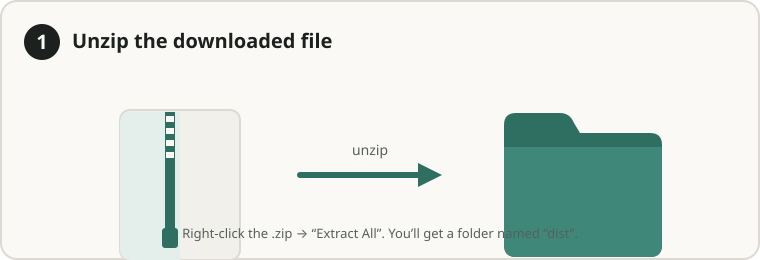
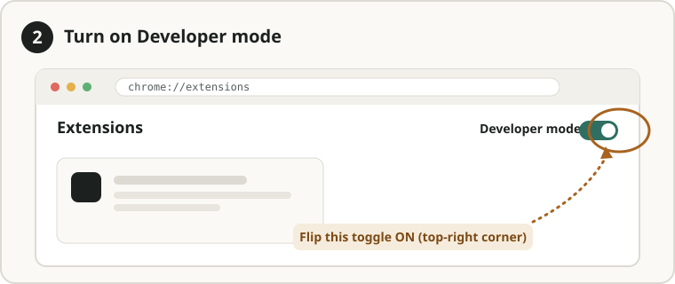
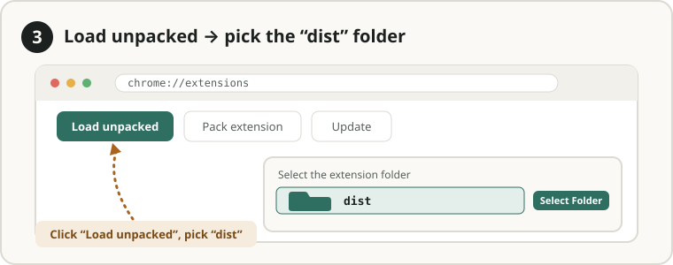

# Markdown Converter — Chrome Extension

Convert **PDF, Word (.docx), Excel (.xlsx/.csv), PowerPoint (.pptx), images (OCR), and web pages** into clean, compact **Markdown** — entirely in your browser. Nothing is uploaded to any server; every conversion runs locally.

Each conversion also runs automatic **quality checks** (word-count ratio vs. source, table-count, truncation, plus the PDF engine's own confidence/OCR/encoding signals) and shows a badge so you know when output is worth a second look.

## Features

- 📄 **PDF → Markdown** (native text extraction via a WASM engine)
- 📝 **DOCX → Markdown** (headings, lists, tables)
- 📊 **XLSX / XLS / CSV → Markdown tables**
- 📽️ **PPTX → Markdown** (text per slide)
- 🖼️ **Images → Markdown** via on-device OCR (Tesseract)
- 🌐 **Any web page → Markdown** (article extraction, like Reader View)
- 👁️ **Built-in viewer** — preview the rendered Markdown in a new tab (with a Raw toggle)
- 📋 Copy, download `.md`, or **Download all (.zip)**
- 🖱️ Right-click context menu on links and pages
- 🔒 **100% local** — no network calls except a one-time OCR language-data download

## Install

### Option A — Load the built extension (no tools needed)

Nothing to install — download, unzip, and load. Works in Chrome, Edge, Brave, or any Chromium browser.

**Step 1 — Download & unzip.** Grab the latest `md-converter-dist.zip` from the [Releases](../../releases) page and unzip it. You'll get a folder named `dist`.



**Step 2 — Open `chrome://extensions` and turn on Developer mode** (toggle, top-right).



**Step 3 — Click "Load unpacked" and select the `dist` folder.**



That's it — the ↓ icon appears in your toolbar. Pin it from the puzzle-piece menu for quick access.

### Option B — Build from source

Requires [Node.js](https://nodejs.org) 18+.

```bash
git clone https://github.com/pushpankar-kiran/markdown-converter-extension.git
cd markdown-converter-extension
npm install
npm run build
```

This produces a `dist/` folder — load it via **Load unpacked** as in Option A.

## Usage

- **Click the toolbar icon** → drag files onto the drop zone (or *Choose files*), then **View / Copy / Download** each result.
- **Convert this page to Markdown** button (or right-click a page) → extracts the main article.
- **Right-click a file link** → *Convert to Markdown* downloads the `.md` directly.

## How it works

Fully client-side. The extension bundles all conversion engines locally (Manifest V3 forbids remote code), so files never leave your machine.

| Source | Library |
|--------|---------|
| PDF | `@firecrawl/pdf-inspector-wasm` |
| DOCX | `mammoth` → `turndown` |
| XLSX/CSV | `xlsx` (SheetJS) |
| PPTX | `jszip` (parses slide XML) |
| Images | `tesseract.js` (OCR) |
| Web pages | `@mozilla/readability` → `turndown` |
| Markdown preview | `marked` |

## Honest limitations

These are worth knowing before you rely on the output:

- **Quality checks are heuristics**, not a guarantee. They catch common failures (missing content, dropped tables, truncation) but can't prove nothing was lost.
- **PPTX is text-only** — slide layout, design, images, and speaker notes are not preserved.
- **OCR** downloads ~10–15 MB of language data from the network the first time you use a given language (then it's cached). Everything else is offline.
- **Image OCR from the right-click context menu** may not work (the background service worker can't spawn the OCR worker) — use the popup for images.
- **`xlsx` (SheetJS)** has a known npm security advisory (prototype pollution + ReDoS) with no patched release on public npm at time of writing. Risk is bounded here because it only ever processes files **you** explicitly choose, locally, and formula/HTML cell parsing is disabled — but if you convert spreadsheets from untrusted sources, treat it with care.

## Privacy

No analytics, no telemetry, no uploads. The only network request the extension ever makes is the one-time OCR language-model download (trained data, not your content). You can verify this in the source.

## Development

```bash
npm install
npm run build      # one-off build into dist/
npm run watch      # rebuild on change
```

Entry points (`src/popup.js`, `src/background.js`, `src/content-script.js`, `src/viewer.js`) are bundled by `esbuild` into single self-contained files, and the WASM/OCR assets are copied into `dist/` — see `build.mjs`.

## License

[MIT](LICENSE)
